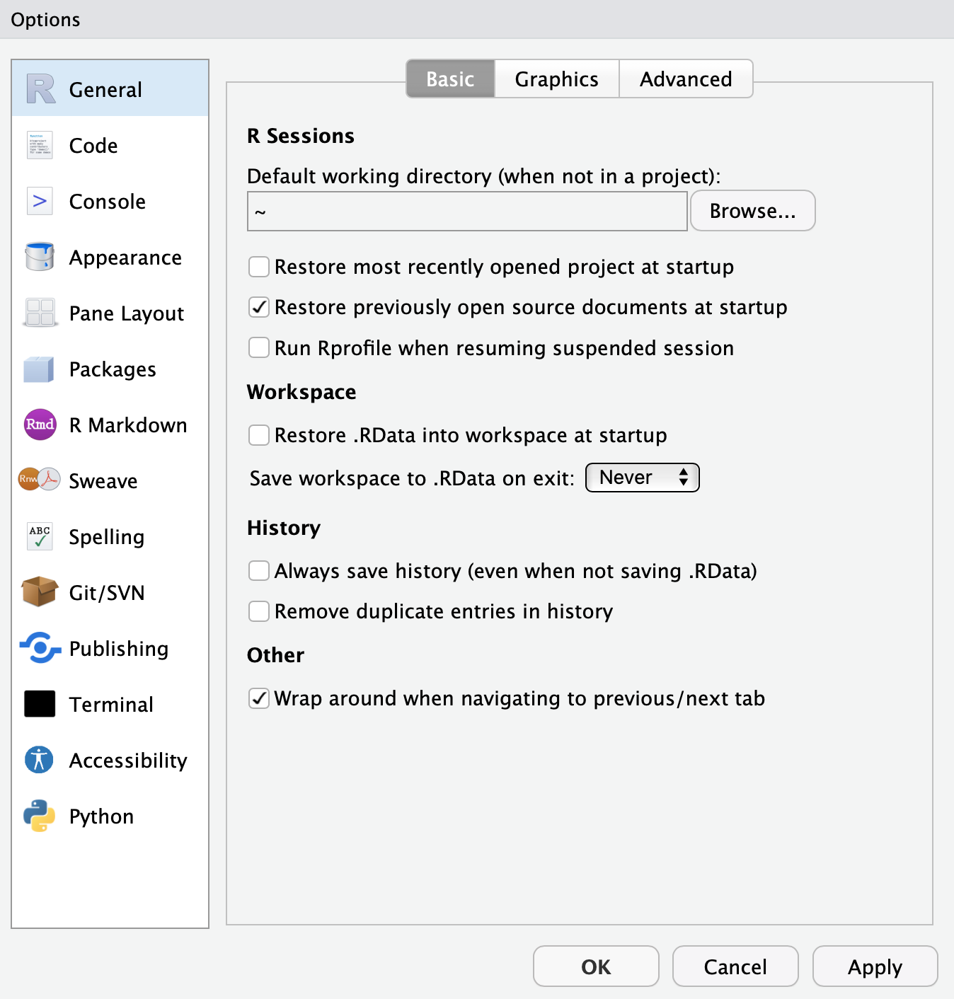

# RStudio-server (ecocast.bigelow.org:8787)


### Need to restart?

```
sudo systemctl start rstudio-server
sudo systemctl stop rstudio-server
sudo systemctl restart rstudio-server
```

### Server pro docs 

I'm not sure if we have Server Pro but here are the [docs](https://docs.rstudio.com/ide/server-pro/index.html)

### ~/.studio

The `~/.studio` directory holds each user's default settings and a cache for saving stuff between sessions.  Sometimes it gets corrupted, and yiu may get weird errors like "Error occured during transmission" while trying to log in.  In that case remove the offending directory `rm -rf ~.rstudio` and try again.  Be advised that all of your settings under `Tools > Global Options...` will be reset to defaults - sorry about that! 


### Hidden files that can break ecocast rstudio

During the course of 2021 a number of RStudio server (ecocast.bigelow.org) encountered login issues.  IT traced the soultion to the per-user configuration files: `~/.config/rstudio`, `~.local/share/rstudio` and possibly `~/.rstudio`.  Use this [shell script](purge_rstudio_configs.sh) to rename them with a date stamp.  We don't know the cause of the problem, but this typically resolves the issue.

Downlaod the file and then run it.

```
sh purge_rstudio_configs.sh
```

Note that running this will reset RStudio's and R's global options (see `Tools > Global Options...`).  Be sure to set them to you preferred settings. Here's an example of a happy global settings state; this user wants each session fo RStudio to be nice and fresh, and not encumbered by restoring previous data and projects.



